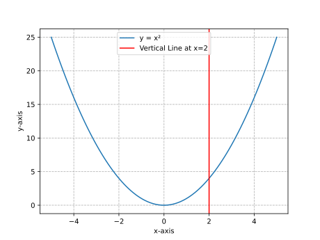

# **Functions**

## Chapter 20: Introduction to Functions

### Definitions

-   **Function**: A relation that assigns to each element in the **domain** exactly one element in the **range**.
-   **Domain**: The set of all possible input values (typically represented as \\( x \\)).
-   **Range**: The set of all possible output values (typically represented as \\( f(x) \\)).
-   **Independent Variable**: The input variable (\\( x \\)) whose value determines the output.
-   **Dependent Variable**: The output (\\( f(x) \\)) whose value depends on the input.
-   **Vertical Line Test**: A graphical method to determine if a curve represents a function. If any vertical line intersects the curve more than once, it is **not** a function.

### Forms or Classifications

#### Types of Functions

| Type of Function       | Notation                                                                                                                          | Description                                                                 | Example                                                                                 |
| ---------------------- | --------------------------------------------------------------------------------------------------------------------------------- | --------------------------------------------------------------------------- | --------------------------------------------------------------------------------------- |
| Linear Function        | \\( f(x) = mx + b \\)                                                                                                               | A straight line with slope \\( m \\) and y-intercept \\( b \\).                 | \\( f(x) = 2x + 3 \\)                                                                     |
| Quadratic Function     | \\( f(x) = ax^2 + bx + c \\)                                                                                                        | A parabola with a vertex and axis of symmetry.                              | \\( f(x) = x^2 - 4 \\)                                                                    |
| Piecewise Function     | \\( f(x) = \begin{cases} \text{expression 1} & \text{if condition 1} \\ \text{expression 2} & \text{if condition 2} \end{cases} \\) | A function defined by different expressions over different intervals.       | \\( f(x) = \begin{cases} x & \text{if } x \geq 0 \\ -x & \text{if } x < 0 \end{cases} \\) |
| Machine Learning Model | \\( y = f(\mathbf{x}) \\)                                                                                                           | A function mapping input features \\( \mathbf{x} \\) to a prediction \\( y \\). | \\( \text{Price} = f(\text{Size, Location}) \\)                                           |

### Examples

-   **Example 1: Evaluating a Function**

    -   **Problem**: Given \\( f(x) = 3x - 5 \\), find \\( f(2) \\) and \\( f(-1) \\).

    -   **Solution**:

        1. For \\( f(2) \\):
           \[
           f(2) = 3(2) - 5 = 6 - 5 = 1
           \]
        2. For \\( f(-1) \\):
           \[
           f(-1) = 3(-1) - 5 = -3 - 5 = -8
           \]

-   **Example 2: Domain and Range**

    -   **Problem**: Identify the domain and range of \\( f(x) = \sqrt{x + 4} \\).

    -   **Solution**:

        1. **Domain**: The expression under the square root must be non-negative:
           \[
           x + 4 \geq 0 \implies x \geq -4
           \]
           Domain: \\( [-4, \infty) \\).
        2. **Range**: The square root function outputs non-negative values:
           \[
           f(x) \geq 0
           \]
           Range: \\( [0, \infty) \\).

-   **Example 3: Vertical Line Test**

    -   **Problem**: Determine if the following graph represents a function.

    -   **Visualization**:

        

    -   **Solution**:

        1. The graph passes the vertical line test because any vertical line intersects the parabola at most once.
        2. Conclusion: The graph represents a function.

-   **Example 4: Piecewise Function**

    -   **Problem**: Evaluate the piecewise function \\( f(x) = \begin{cases} 2x + 1 & \text{if } x < 0 \\ x^2 & \text{if } x \geq 0 \end{cases} \\) at \\( x = -2 \\), \\( x = 0 \\), and \\( x = 3 \\).

    -   **Solution**:

        1. For \\( x = -2 \\) (use \\( 2x + 1 \\)):
           \[
           f(-2) = 2(-2) + 1 = -4 + 1 = -3
           \]
        2. For \\( x = 0 \\) (use \\( x^2 \\)):
           \[
           f(0) = 0^2 = 0
           \]
        3. For \\( x = 3 \\) (use \\( x^2 \\)):
           \[
           f(3) = 3^2 = 9
           \]

-   **Example 5: Real-World Application (Machine Learning)**

    -   **Problem**: A machine learning model predicts house prices based on square footage. The function is \\( \text{Price} = 150 \times \text{Size} + 50,000 \\). Predict the price for a house with \\( \text{Size} = 1200 \\) sq ft.

    -   **Solution**:

        1. Substitute \\( \text{Size} = 1200 \\) into the function:
           \[
           \text{Price} = 150 \times 1200 + 50,000 = 180,000 + 50,000 = 230,000
           \]
        2. The predicted price is \$230,000.

## Key Takeaways

> -   A **function** is a rule that assigns exactly one output to each input.
> -   The **domain** is the set of valid inputs, and the **range** is the set of possible outputs.
> -   The **vertical line test** determines if a graph represents a function.
> -   Functions can model real-world relationships, such as machine learning models.
> -   **Piecewise functions** use different rules for different intervals of the domain.
