# **Graphing**

1.  **Cartesian Coordinate Plane**: A two-dimensional plane formed by two perpendicular number lines (the x-axis and y-axis) that intersect at the origin (0, 0).
2.  **Origin**: The central point of the Cartesian plane at \((0,0)\).
3.  **Ordered Pair**: A pair of numbers \\((x, y)\\) that represents a point in the Cartesian plane, where \\(x\\) is the horizontal distance from the origin and \\(y\\) is the vertical distance.

4.  **Quadrants**: The four sections of the Cartesian plane, divided by the x-axis and y-axis:

    -   Quadrant I: \(x > 0, y > 0\)
    -   Quadrant II: \(x < 0, y > 0\)
    -   Quadrant III: \(x < 0, y < 0\)
    -   Quadrant IV: \(x > 0, y < 0\)

5.  **Collinear Points**: Points that lie on the same straight line.

## Chapter 13: Linear Equations in Two Variables

### Definitions

-   **Linear Equation in Two Variables**: An equation of the form \\(Ax + By = C\\), where \\(A\\), \\(B\\), and \\(C\\) are constants, and \\(A\\) and \\(B\\) are not both zero.

-   **Solution to a Linear Equation**: Any ordered pair \\((x, y)\\) that, when substituted into the equation, makes the equation true.

-   **Slope**: A measure of the steepness and direction of a line, typically denoted by \\(m\\). It represents the ratio of the vertical change to the horizontal change between any two points on the line.

-   **x-intercept**: The point where a line crosses the x-axis (has the form \\((a, 0)\\)).

-   **y-intercept**: The point where a line crosses the y-axis (has the form \\((0, b)\\)).

### Forms of Linear Equations

#### Standard Form

\\[ Ax + By = C \\]

-   Useful for finding x and y intercepts
-   x-intercept: \\((\frac{C}{A}, 0)\\) when \\(B \neq 0$
-   y-intercept: \\((0, \frac{C}{B})\\) when \\(A \neq 0$

#### Slope-Intercept Form

\\[ y = mx + b \\]

-   \\(m\\) is the slope of the line
-   \\(b\\) is the y-intercept
-   Directly shows how \\(y\\) changes as \\(x\\) changes

#### Point-Slope Form

\\[ y - y_1 = m(x - x_1) \\]

-   \\(m\\) is the slope of the line
-   \\((x_1, y_1)\\) is a point on the line
-   Useful when a point and slope are known

### Examples

-   **Example 1: Converting Between Forms**

    -   Problem: Convert the equation \\(3x + 2y = 6\\) to slope-intercept form.
    -   Solution:
        1. Start with \\( 3x + 2y = 6 \\)
        2. Solve for \\( y \\):
            $$
            2y = 6 - 3x \implies
            y = \frac{6 - 3x}{2}
            $$
            $$
            y = \frac{6}{2} - \frac{3x}{2} \implies
            y = 3 - \frac{3}{2}x
            $$
            $$
            y = -\frac{3}{2}x + 3
            $$
        3. Now in slope-intercept form, we can identify:
            - Slope \\(m = -\frac{3}{2}\\)
            - y-intercept \\(b = 3\\), or point \\((0, 3)\\)

-   **Example 2: Finding Intercepts**

    -   Problem: Find the x and y intercepts of the line \\(4x - 5y = 20\\).
    -   Solution:
        1. For x-intercept, set \\(y = 0\\):
            $$
            4x - 5(0) = 20 \implies
            4x = 20
            $$
            $$
            x = 5
            $$
            So the x-intercept is at point \\( (5, 0) \\)
        2. For y-intercept, set \\( x = 0 \\):
            $$
            4(0) - 5y = 20 \implies
            -5y = 20
            $$
            $$
            y = -4
            $$
            So the y-intercept is at point \\( (0, -4) \\)

-   **Example 3: Graphing a Linear Equation**

    -   Problem: Graph the line \\( y = 2x - 3 \\).
    -   Solution:
        1. Identify the slope \\( m = 2 \\) and y-intercept \\( b = -3 \\)
        2. Plot the y-intercept: \\( (0, -3) \\)
        3. Use the slope to find another point:
           Starting from \\( (0, -3) \\), move 1 unit right and 2 units up to get \\( (1, -1) \\)
        4. Draw a line through these points

    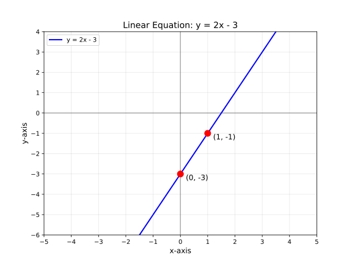

-   **Example 4: Finding the Equation of a Line**

    -   Problem: Find the equation of a line passing through the points \\( (2, 5) \\) and \\( (4, 9) \\).
    -   Solution:
        1. Calculate the slope:
            $$
            m = \frac{y_2 - y_1}{x_2 - x_1} = \frac{9 - 5}{4 - 2} = \frac{4}{2} = 2
            $$
        2. Use point-slope form with \\( (x_1, y_1) = (2, 5) \\):
            $$
            y - 5 = 2(x - 2) \implies
            y - 5 = 2x - 4
            $$
            $$
            y = 2x - 4 + 5 \implies
            y = 2x + 1
            $$
        3. The equation in slope-intercept form is \\( y = 2x + 1 \\), with slope \\( m = 2 \\) and y-intercept \\( b = 1 \\)

-   **Example 5: Parallel and Perpendicular Lines**

    -   Problem: Find the equation of a line that passes through the point \\( (3, 4) \\) and is:
        a) Parallel to the line \\( y = 2x - 5 \\)
        b) Perpendicular to the line \\( y = 2x - 5 \\)
    -   Solution:
        a) Parallel lines have the same slope. Line \\( y = 2x - 5 \\) has slope \\( m = 2 \\).

        1. Use point-slope form with \\( m = 2 \\) and \\( (x_1, y_1) = (3, 4) \\):
            $$
            y - 4 = 2(x - 3) \implies
            y - 4 = 2x - 6
            $$
            $$
            y = 2x - 6 + 4 \implies
            y = 2x - 2
            $$
        2. The parallel line equation is \\( y = 2x - 2 \\)

        b) Perpendicular lines have slopes that are negative reciprocals: \\( m_1 \times m_2 = -1 \\)

        1. Original line has slope \\( m_1 = 2 \\), so perpendicular slope \\( m_2 = -\frac{1}{2} \\)
        2. Use point-slope form with \\( m = -\frac{1}{2} \\) and \\( (x_1, y_1) = (3, 4) \\):
            $$
            y - 4 = -\frac{1}{2}(x - 3) \implies
            y - 4 = -\frac{1}{2}x + \frac{3}{2}
            $$
            $$
            y = -\frac{1}{2}x + \frac{3}{2} + 4 \implies
            y = -\frac{1}{2}x + \frac{3}{2} + \frac{8}{2}
            $$
            $$
            y = -\frac{1}{2}x + \frac{11}{2}
            $$
        3. The perpendicular line equation is \\( y = -\frac{1}{2}x + \frac{11}{2} \\)

-   **Example 6: Application in Data Analysis**
    -   Problem: A dataset shows the relationship between study time (x) in hours and test score (y) in percentage. Data points: \\( (1, 65) \\), \\( (2, 70) \\), \\( (3, 75) \\), \\( (4, 80) \\). Find the linear equation that models this relationship and predict the score for 5 hours of study.
    -   Solution:
        1. Calculate the slope using the first and last points:
            $$
            m = \frac{80 - 65}{4 - 1} = \frac{15}{3} = 5
            $$
        2. Use point-slope form with \\( (x_1, y_1) = (1, 65) \\):
            $$
            y - 65 = 5(x - 1) \implies
            y - 65 = 5x - 5
            $$
            $$
            y = 5x - 5 + 65 \implies
            y = 5x + 60
            $$
        3. The model is \\( y = 5x + 60 \\), which means each additional hour of study increases the score by 5 percentage points, with a base score of 60% for 0 hours of study.
        4. Prediction for 5 hours:
            $$
            y = 5(5) + 60 = 25 + 60 = 85
            $$
            With 5 hours of study, the predicted test score is 85%.

### Key Takeaways

> -   A linear equation in two variables (\\( Ax + By = C \\)) represents a straight line when graphed on a Cartesian coordinate plane.
> -   Every point \\( (x, y) \\) on this line is a solution to the equation.
> -   The three common forms of linear equations (Standard, Slope-Intercept, and Point-Slope) each provide different insights into the properties of the line.
> -   The slope (\\( m \\)) measures the steepness and direction of the line, calculated as \\( \frac{\text{rise}}{\text{run}} \\) or \\( \frac{y_2 - y_1}{x_2 - x_1} \\).
> -   Parallel lines have the same slope, while perpendicular lines have slopes that are negative reciprocals of each other (\\( m_1 \times m_2 = -1 \\)).
> -   Linear equations can model real-world relationships, allowing us to make predictions based on the model.
> -   In machine learning, linear equations form the foundation for understanding relationships between features and making predictions.

## Chapter 14: Plotting Ordered Pairs

### Definitions

-   **Absolute Value**: The distance of a number from zero, used to determine movement along axes.

### Examples

-   **Example 1: Plotting a Simple Ordered Pair**

    -   **Problem Statement:** Plot the point \\((3, -2)\\) on the Cartesian plane.

    -   **Solution:**

        1. Start at the origin \\((0,0)\\).
        2. Move 3 units to the right (since \\(x = 3\\)).
        3. Move 2 units down (since \\(y = -2\\)).
        4. Mark the point \\((3, -2)\\).

-   **Example 2: Identifying the Quadrant of a Point**

    -   **Problem Statement:** Determine the quadrant of the point \\((-4, 5)\\).

    -   **Solution:**

        -   The x-coordinate is negative and the y-coordinate is positive.
        -   According to quadrant rules, the point is in Quadrant II.

-   **Example 3: Points on Axes**

    -   **Problem Statement:** Identify the location of \\((0, -7)\\).

    -   **Solution:**

        -   The x-coordinate is 0, meaning the point lies on the y-axis.
        -   The point is 7 units below the origin.

-   **Example 4: Symmetry in Ordered Pairs**

    -   **Problem Statement:** Reflect the point \\((2,3)\\) across the y-axis.

    -   **Solution:**

        -   The reflection across the y-axis negates the x-coordinate.
        -   The new point is \\((-2,3)\\).

-   **Example 5: Distance Between Two Points**

    -   **Problem Statement:** Find the distance between \\((1,2)\\) and \\((4,6)\\).

    -   **Solution:**
        Using the distance formula:
        $$
        D = \sqrt{(x_2 - x_1)^2 + (y_2 - y_1)^2}
        $$
        $$
        D = \sqrt{(4-1)^2 + (6-2)^2}
        $$
        $$
        D = \sqrt{3^2 + 4^2} = \sqrt{9+16} = \sqrt{25} = 5
        $$

-   **Example 6: Real-World Application**

    -   **Problem Statement:** A drone starts at \\((0,0)\\) and moves 5 units east and 3 units north. What is its final position?

    -   **Solution:**

        -   Move 5 units right (east) → \\((5,0)\\)
        -   Move 3 units up (north) → \\((5,3)\\)
        -   The final position is \\((5,3)\\).

    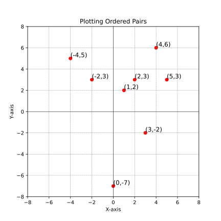

### Key Takeaways

> -   The **distance formula** can be used to calculate the distance between two points.
> -   **Real-world applications** of ordered pairs include navigation, computer graphics, and data visualization.

## Chapter 15: Graphing Linear Equations

### Examples

-   **Example 1: Plotting Points to Graph a Line**

    -   **Problem**: Graph the equation \\( y = 2x + 1 \\) by plotting points.

    -   **Solution**:
        1. Choose values for \\( x \\):
            - Let \\( x = 0 \\): \\( y = 2(0) + 1 = 1 \\) → Point \\( (0, 1) \\)
            - Let \\( x = 1 \\): \\( y = 2(1) + 1 = 3 \\) → Point \\( (1, 3) \\)
            - Let \\( x = -1 \\): \\( y = 2(-1) + 1 = -1 \\) → Point \\( (-1, -1) \\)
        2. Plot the points \\( (0, 1) \\), \\( (1, 3) \\), and \\( (-1, -1) \\) on the coordinate plane.
        3. Draw a straight line through the points.

    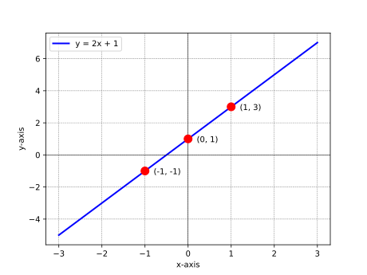

-   **Example 2: Using Slope-Intercept Form**

    -   **Problem**: Graph the equation \\( y = -\frac{1}{2}x + 3 \\) using the slope-intercept form.

    -   **Solution**:
        1. Identify the y-intercept \\( b = 3 \\) → Point \\( (0, 3) \\).
        2. Identify the slope \\( m = -\frac{1}{2} \\).
        3. From \\( (0, 3) \\), move 2 units to the right (run) and 1 unit down (rise) to find another point \\( (2, 2) \\).
        4. Draw a line through \\( (0, 3) \\) and \\( (2, 2) \\).

    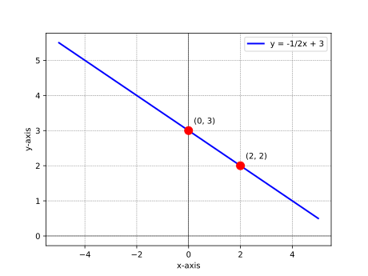

-   **Example 3: Finding X and Y Intercepts**

    -   **Problem**: Graph the equation \\( 3x + 2y = 6 \\) using intercepts.

    -   **Solution**:
        1. Find the y-intercept by setting \\( x = 0 \\):
            $$
            3(0) + 2y = 6 \implies y = 3 \quad \text{→ Point } (0, 3)
            $$
        2. Find the x-intercept by setting \\( y = 0 \\):
            $$
            3x + 2(0) = 6 \implies x = 2 \quad \text{→ Point } (2, 0)
            $$
        3. Plot the points \\( (0, 3) \\) and \\( (2, 0) \\) and draw the line.

    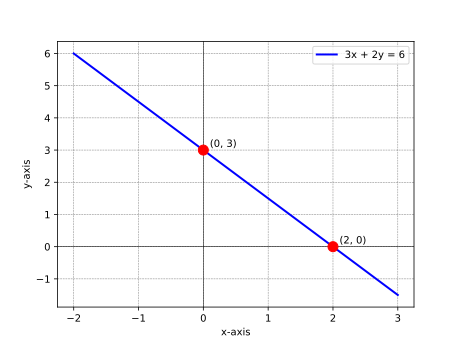

-   **Example 4: Real-World Application**

    -   **Problem**: A taxi service charges a base fare of $5 plus $2 per mile. Write the equation and graph the cost as a function of miles traveled.

    -   **Solution**:
        1. Let \\( x \\) = miles traveled, \\( y \\) = total cost.
        2. The equation is \\( y = 2x + 5 \\).
        3. Graph the line using the y-intercept \\( (0, 5) \\) and slope \\( m = 2 \\).

    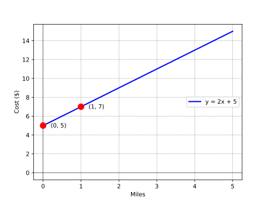

-   **Example 5: Horizontal and Vertical Lines**

    -   **Problem**: Graph the lines \\( y = 4 \\) and \\( x = -3 \\).

    -   **Solution**:
        1. \\( y = 4 \\) is a horizontal line passing through \\( (0, 4) \\).
        2. \\( x = -3 \\) is a vertical line passing through \\( (-3, 0) \\).

    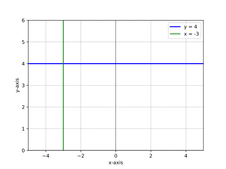

### Key Takeaways

> -   The graph of a linear equation is a straight line.
> -   The slope-intercept form \\( y = mx + b \\) is the most efficient way to graph a line.
> -   The slope \\( m \\) determines the steepness and direction of the line.
> -   The y-intercept \\( b \\) is the point where the line crosses the y-axis.
> -   Real-world applications of linear equations include cost analysis, distance-time relationships, and more.
> -   Graphing inequalities involves shading the region of the plane that satisfies the inequality.

## Chapter 16: Slope Formula

### Definitions

-   **Slope (\\( m \\))**: A measure of the steepness and direction of a line. It is calculated as the ratio of the vertical change (rise) to the horizontal change (run) between two points on the line:

    \[
    m = \frac{y_2 - y_1}{x_2 - x_1}
    \]

## 2. Forms or Classifications

### Types of Slope

| Type of Slope   | Description                           | Example Equation  |
| --------------- | ------------------------------------- | ----------------- |
| Positive Slope  | Line rises from left to right.        | \\( y = 2x + 1 \\)  |
| Negative Slope  | Line falls from left to right.        | \\( y = -3x + 4 \\) |
| Zero Slope      | Horizontal line (no vertical change). | \\( y = 5 \\)       |
| Undefined Slope | Vertical line (no horizontal change). | \\( x = -2 \\)      |

### Examples

-   **Example 1: Calculating Slope from Two Points**

    -   **Problem**: Find the slope of the line passing through the points \\( (1, 2) \\) and \\( (3, 6) \\).

    -   **Solution**:

        1. Identify the coordinates:
           \[
           (x_1, y_1) = (1, 2), \quad (x_2, y_2) = (3, 6)
           \]
        2. Apply the slope formula:
           \[
           m = \frac{y_2 - y_1}{x_2 - x_1} = \frac{6 - 2}{3 - 1} = \frac{4}{2} = 2
           \]
           The slope is \\( 2 \\).

-   **Example 2: Negative Slope**

    -   **Problem**: Find the slope of the line passing through the points \\( (-2, 4) \\) and \\( (1, -2) \\).

    -   **Solution**:

        1. Identify the coordinates:
           \[
           (x_1, y_1) = (-2, 4), \quad (x_2, y_2) = (1, -2)
           \]
        2. Apply the slope formula:
           \[
           m = \frac{y_2 - y_1}{x_2 - x_1} = \frac{-2 - 4}{1 - (-2)} = \frac{-6}{3} = -2
           \]
           The slope is \\( -2 \\).

-   **Example 3: Zero Slope**

    -   **Problem**: Find the slope of the line passing through the points \\( (3, 5) \\) and \\( (7, 5) \\).

    -   **Solution**:

        1. Identify the coordinates:
           \[
           (x_1, y_1) = (3, 5), \quad (x_2, y_2) = (7, 5)
           \]
        2. Apply the slope formula:
           \[
           m = \frac{y_2 - y_1}{x_2 - x_1} = \frac{5 - 5}{7 - 3} = \frac{0}{4} = 0
           \]
           The slope is \\( 0 \\), indicating a horizontal line.

-   **Example 4: Undefined Slope**

    -   **Problem**: Find the slope of the line passing through the points \\( (4, 1) \\) and \\( (4, 7) \\).

    -   **Solution**:
        1. Identify the coordinates:
           \[
           (x_1, y_1) = (4, 1), \quad (x_2, y_2) = (4, 7)
           \]
        2. Apply the slope formula:
           \[
           m = \frac{y_2 - y_1}{x_2 - x_1} = \frac{7 - 1}{4 - 4} = \frac{6}{0}
           \]
           Division by zero is undefined, so the slope is undefined, indicating a vertical line.

-   **Example 5: Real-World Application**

    -   **Problem**: A car travels 100 miles in 2 hours and 200 miles in 4 hours. Calculate the slope (speed) of the car's journey.

    -   **Solution**:
        1. Let \\( x \\) = time (hours), \\( y \\) = distance (miles).
        2. Identify the points:
           \[
           (x_1, y_1) = (2, 100), \quad (x_2, y_2) = (4, 200)
           \]
        3. Apply the slope formula:
           \[
           m = \frac{200 - 100}{4 - 2} = \frac{100}{2} = 50
           \]
           The slope is \\( 50 \\) mph.

### Key Takeaways

> -   The slope formula \\( m = \frac{y_2 - y_1}{x_2 - x_1} \\) calculates the steepness and direction of a line.
> -   Positive slope indicates an upward trend, while negative slope indicates a downward trend.
> -   Zero slope corresponds to a horizontal line, and undefined slope corresponds to a vertical line.
> -   Slope is widely used in real-world applications, such as calculating speed, rates of change, and gradients.

---

## Chapter 17: Equations of a Line

### Definitions

-   **Slope-Intercept Form**: \\( y = mx + b \\), where \\( m \\) is the slope and \\( b \\) is the y-intercept.
-   **Point-Slope Form**: \\( y - y_1 = m(x - x_1) \\), where \\( m \\) is the slope and \\( (x_1, y_1) \\) is a point on the line.
-   **Standard Form**: \\( Ax + By = C \\), where \\( A \\), \\( B \\), and \\( C \\) are integers.
-   **Horizontal Line**: \\( y = b \\), where \\( b \\) is a constant.
-   **Vertical Line**: \\( x = a \\), where \\( a \\) is a constant.

### Examples

-   **Example 1: Writing an Equation in Slope-Intercept Form**

    -   **Problem**: Write the equation of a line with slope \\( 3 \\) and y-intercept \\( -2 \\).

    -   **Solution**:
        1. Use the slope-intercept form:
            $$
            y = mx + b
            $$
        2. Substitute \\( m = 3 \\) and \\( b = -2 \\):
            $$
            y = 3x - 2
            $$

-   **Example 2: Writing an Equation in Point-Slope Form**

    -   **Problem**: Write the equation of a line with slope \\( -1 \\) passing through the point \\( (2, 4) \\).

    -   **Solution**:
        1. Use the point-slope form:
            $$
            y - y_1 = m(x - x_1)
            $$
        2. Substitute \\( m = -1 \\), \\( x_1 = 2 \\), and \\( y_1 = 4 \\):
            $$
            y - 4 = -1(x - 2)
            $$
        3. Simplify:
            $$
            y - 4 = -x + 2 \implies y = -x + 6
            $$

-   **Example 3: Converting to Standard Form**

    -   **Problem**: Convert \\( y = \frac{2}{3}x - 5 \\) to standard form.

    -   **Solution**:
        1. Start with the slope-intercept form:
            $$
            y = \frac{2}{3}x - 5
            $$
        2. Multiply all terms by 3 to eliminate the fraction:
            $$
            3y = 2x - 15
            $$
        3. Rearrange to standard form \\( Ax + By = C \\):
            $$
            -2x + 3y = -15
            $$

-   **Example 4: Writing an Equation from Two Points**

    -   **Problem**: Write the equation of the line passing through \\( (1, 3) \\) and \\( (4, 9) \\).

    -   **Solution**:
        1. Calculate the slope:
            $$
            m = \frac{9 - 3}{4 - 1} = \frac{6}{3} = 2
            $$
        2. Use the point-slope form with \\( (1, 3) \\):
            $$
            y - 3 = 2(x - 1)
            $$
        3. Simplify:
            $$
            y - 3 = 2x - 2 \implies y = 2x + 1
            $$

-   **Example 5: Real-World Application**

    -   **Problem**: A company's revenue increases by $500 for every additional unit sold. If the revenue is $2000 when 10 units are sold, write the equation of the revenue line.

    -   **Solution**:
        1. Let \\( x \\) = units sold, \\( y \\) = revenue.
        2. The slope \\( m = 500 \\).
        3. Use the point \\( (10, 2000) \\) in point-slope form:
            $$
            y - 2000 = 500(x - 10)
            $$
        4. Simplify:
            $$
            y - 2000 = 500x - 5000 \implies y = 500x - 3000
            $$

### Key Takeaways Section

> -   The slope-intercept form \\( y = mx + b \\) is the most common way to express a linear equation.
> -   The point-slope form \\( y - y_1 = m(x - x_1) \\) is useful when a point and slope are known.
> -   Standard form \\( Ax + By = C \\) is often used in systems of equations.
> -   Horizontal and vertical lines have unique equations \\( y = b \\) and \\( x = a \\), respectively.
> -   Linear equations are widely used in modeling real-world scenarios, such as revenue and cost analysis.

## Chapter 18: Parallel & Perpendicular Lines

### Definitions

-   **Parallel Lines**: Two lines are parallel if they have the **same slope** and will never intersect.
-   **Perpendicular Lines**: Two lines are perpendicular if the product of their slopes is **-1** (i.e., their slopes are **negative reciprocals** of each other).
-   **Slope (\\( m \\))**: The measure of the steepness of a line, calculated as \\( m = \frac{y_2 - y_1}{x_2 - x_1} \\).
-   **Negative Reciprocal**: If the slope of one line is \\( m \\), the slope of a perpendicular line is \\( -\frac{1}{m} \\).

---

### Forms or Classifications

#### Relationships Between Lines

| Relationship  | Condition on Slopes                               | Example Equations                                |
| ------------- | ------------------------------------------------- | ------------------------------------------------ |
| Parallel      | \\( m_1 = m_2 \\)                                   | \\( y = 2x + 3 \\) and \\( y = 2x - 1 \\)            |
| Perpendicular | \\( m_1 \cdot m_2 = -1 \\)                          | \\( y = 2x + 3 \\) and \\( y = -\frac{1}{2}x + 4 \\) |
| Neither       | Slopes are neither equal nor negative reciprocals | \\( y = 2x + 3 \\) and \\( y = 3x - 1 \\)            |

---

### Examples

-   **Example 1: Identifying Parallel Lines**

    -   **Problem**: Determine if the lines \\( y = 3x + 2 \\) and \\( y = 3x - 5 \\) are parallel.

    -   **Solution**:
        1. Compare the slopes of both lines:
            - Slope of first line: \\( m_1 = 3 \\).
            - Slope of second line: \\( m_2 = 3 \\).
        2. Since \\( m_1 = m_2 \\), the lines are **parallel**.

---

-   **Example 2: Identifying Perpendicular Lines**

    -   **Problem**: Determine if the lines \\( y = 4x + 1 \\) and \\( y = -\frac{1}{4}x + 3 \\) are perpendicular.

    -   **Solution**:
        1. Compare the slopes of both lines:
            - Slope of first line: \\( m_1 = 4 \\).
            - Slope of second line: \\( m_2 = -\frac{1}{4} \\).
        2. Check if the product of the slopes is \\(-1\\):
           \[
           m_1 \cdot m_2 = 4 \cdot \left(-\frac{1}{4}\right) = -1
           \]
        3. Since the product is \\(-1\\), the lines are **perpendicular**.

---

-   **Example 3: Writing the Equation of a Parallel Line**

    -   **Problem**: Write the equation of a line parallel to \\( y = -2x + 3 \\) that passes through the point \\( (1, 4) \\).

    -   **Solution**:
        1. The slope of the given line is \\( m = -2 \\). A parallel line will have the same slope.
        2. Use the point-slope form with the point \\( (1, 4) \\):
           \[
           y - y_1 = m(x - x_1) \implies y - 4 = -2(x - 1)
           \]
        3. Simplify:
           \[
           y - 4 = -2x + 2 \implies y = -2x + 6
           \]
        4. The equation of the parallel line is \\( y = -2x + 6 \\).

---

-   **Example 4: Writing the Equation of a Perpendicular Line**

    -   **Problem**: Write the equation of a line perpendicular to \\( y = \frac{3}{4}x - 2 \\) that passes through the point \\( (0, 5) \\).

    -   **Solution**:
        1. The slope of the given line is \\( m_1 = \frac{3}{4} \\). The slope of a perpendicular line is the negative reciprocal:
           \[
           m_2 = -\frac{4}{3}
           \]
        2. Use the point-slope form with the point \\( (0, 5) \\):
           \[
           y - y_1 = m(x - x_1) \implies y - 5 = -\frac{4}{3}(x - 0)
           \]
        3. Simplify:
           \[
           y - 5 = -\frac{4}{3}x \implies y = -\frac{4}{3}x + 5
           \]
        4. The equation of the perpendicular line is \\( y = -\frac{4}{3}x + 5 \\).

---

-   **Example 5: Real-World Application**

    -   **Problem**: Two roads intersect at a right angle. The first road follows the equation \\( y = 2x + 1 \\). Find the equation of the second road if it passes through the point \\( (3, 4) \\).

    -   **Solution**:
        1. The slope of the first road is \\( m_1 = 2 \\). The slope of the second road (perpendicular) is:
           \[
           m_2 = -\frac{1}{2}
           \]
        2. Use the point-slope form with the point \\( (3, 4) \\):
           \[
           y - 4 = -\frac{1}{2}(x - 3)
           \]
        3. Simplify:
           \[
           y - 4 = -\frac{1}{2}x + \frac{3}{2} \implies y = -\frac{1}{2}x + \frac{11}{2}
           \]
        4. The equation of the second road is \\( y = -\frac{1}{2}x + \frac{11}{2} \\).

---

### Key Takeaways

> -   **Parallel lines** have the same slope and never intersect.
> -   **Perpendicular lines** have slopes that are negative reciprocals of each other and intersect at a right angle.
> -   The slope-intercept form \\( y = mx + b \\) is useful for identifying parallel and perpendicular lines.
> -   Real-world applications include designing roads, buildings, and other structures where angles and orientations are important.

---

## Chapter 19: Graphing Inequalities

### Definitions

-   **Linear Inequality**: An inequality that can be written in the form \\( Ax + By < C \\), \\( Ax + By > C \\), \\( Ax + By \leq C \\), or \\( Ax + By \geq C \\).
-   **Boundary Line**: The line corresponding to the equation \\( Ax + By = C \\), which divides the coordinate plane into two regions.
-   **Shaded Region**: The area of the plane that represents all solutions to the inequality.
-   **Test Point**: A point used to determine which side of the boundary line satisfies the inequality.

---

### Forms or Classifications

#### Types of Inequalities

| Inequality Symbol        | Boundary Line Type         | Shaded Region                    |
| ------------------------ | -------------------------- | -------------------------------- |
| \\( < \\) or \\( > \\)       | Dashed line (not included) | Above or below the boundary line |
| \\( \leq \\) or \\( \geq \\) | Solid line (included)      | Above or below the boundary line |

---

### Examples

-   **Example 1: Graphing \\( y > 2x + 1 \\)**

    -   **Problem**: Graph the inequality \\( y > 2x + 1 \\).

    -   **Solution**:
        1. Graph the boundary line \\( y = 2x + 1 \\) as a **dashed line** (since the inequality is strict).
        2. Choose a test point not on the line, such as \\( (0, 0) \\).
        3. Substitute \\( (0, 0) \\) into the inequality:
           \[
           0 > 2(0) + 1 \implies 0 > 1 \quad \text{(False)}
           \]
        4. Shade the region **above** the boundary line, as the test point does not satisfy the inequality.

    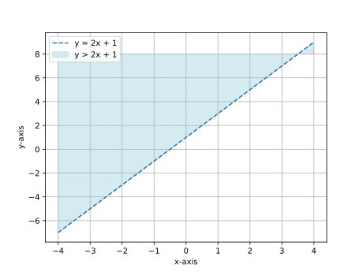

---

-   **Example 2: Graphing \\( y \leq -3x + 2 \\)**

    -   **Problem**: Graph the inequality \\( y \leq -3x + 2 \\).

    -   **Solution**:
        1. Graph the boundary line \\( y = -3x + 2 \\) as a **solid line** (since the inequality includes equality).
        2. Choose a test point not on the line, such as \\( (0, 0) \\).
        3. Substitute \\( (0, 0) \\) into the inequality:
           \[
           0 \leq -3(0) + 2 \implies 0 \leq 2 \quad \text{(True)}
           \]
        4. Shade the region **below** the boundary line, as the test point satisfies the inequality.

    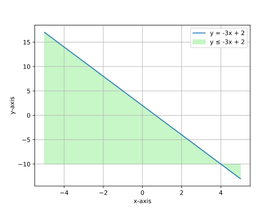

---

-   **Example 3: Graphing \\( 2x + 3y \geq 6 \\)**

    -   **Problem**: Graph the inequality \\( 2x + 3y \geq 6 \\).

    -   **Solution**:
        1. Rewrite the inequality in slope-intercept form:
           \[
           3y \geq -2x + 6 \implies y \geq -\frac{2}{3}x + 2
           \]
        2. Graph the boundary line \\( y = -\frac{2}{3}x + 2 \\) as a **solid line**.
        3. Choose a test point not on the line, such as \\( (0, 0) \\).
        4. Substitute \\( (0, 0) \\) into the inequality:
           \[
           0 \geq -\frac{2}{3}(0) + 2 \implies 0 \geq 2 \quad \text{(False)}
           \]
        5. Shade the region **above** the boundary line.

    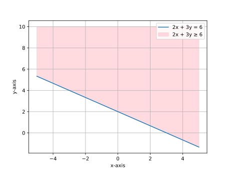

---

-   **Example 4: Real-World Application**

    -   **Problem**: A company produces two products, \\( x \\) and \\( y \\). The production constraint is \\( 4x + 5y \leq 20 \\). Graph the feasible region.

    -   **Solution**:
        1. Rewrite the inequality in slope-intercept form:
           \[
           5y \leq -4x + 20 \implies y \leq -\frac{4}{5}x + 4
           \]
        2. Graph the boundary line \\( y = -\frac{4}{5}x + 4 \\) as a **solid line**.
        3. Choose a test point not on the line, such as \\( (0, 0) \\).
        4. Substitute \\( (0, 0) \\) into the inequality:
           \[
           0 \leq -\frac{4}{5}(0) + 4 \implies 0 \leq 4 \quad \text{(True)}
           \]
        5. Shade the region **below** the boundary line.

    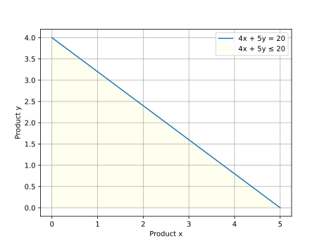

---

## Key Takeaways

> -   Linear inequalities are graphed by first drawing the boundary line and then shading the appropriate region.
> -   Use a **dashed line** for strict inequalities (\\( < \\) or \\( > \\)) and a **solid line** for inclusive inequalities (\\( \leq \\) or \\( \geq \\)).
> -   A **test point** helps determine which side of the boundary line to shade.
> -   Graphing inequalities is essential in optimization problems, such as linear programming.
