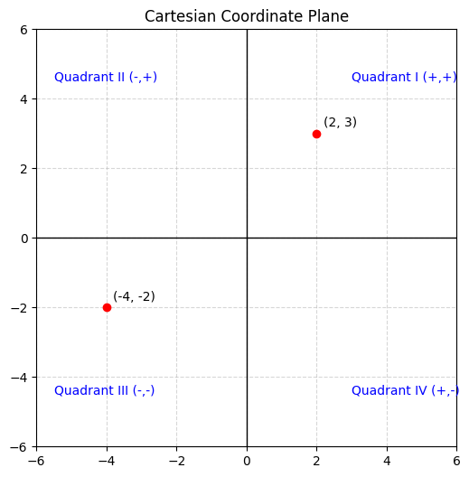
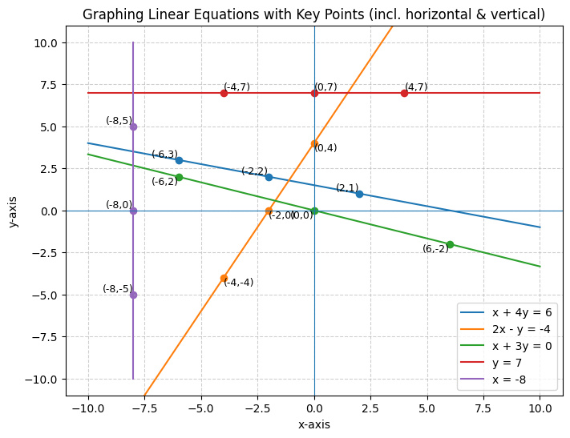
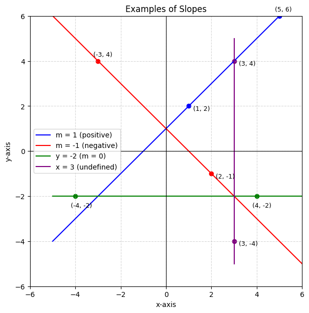
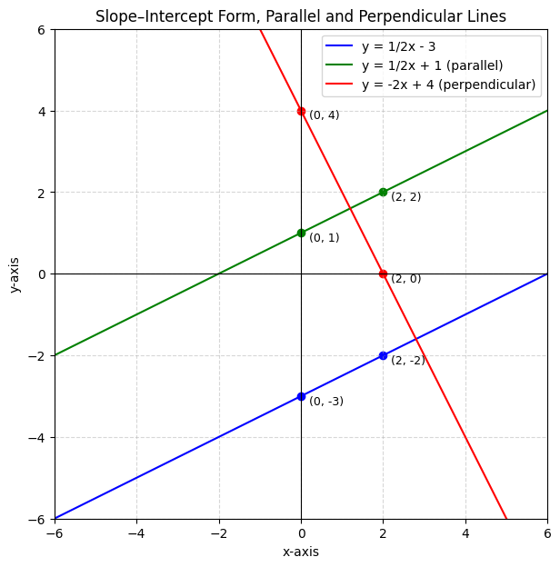

# Graphing Equations

## Chapter 13: Linear Equations in Two Variables – Introduction

### Meaning of a Linear Relation with Two Variables

A **linear equation in two variables** is an equation that can be written in the form:

\[
ax + by + c = 0
\]

where \(a, b, c\) are real numbers, and **at least one of \(a\) or \(b\) is nonzero**.  
Examples:

-   \(2x + y = 5\)
-   \(x - 3y + 7 = 0\)

Such equations describe **straight lines** when plotted on the coordinate plane.

---

### Understanding an Ordered Pair

An **ordered pair** \((x, y)\) is a way of writing the values of two variables together.

-   The **first number** is the \(x\)-coordinate.
-   The **second number** is the \(y\)-coordinate.
-   The order matters: \((2, 5)\) is not the same as \((5, 2)\).

Example:

-   \((3, 4)\) → \(x = 3\), \(y = 4\).
-   \((-2, 1)\) → \(x = -2\), \(y = 1\).

---

### Rectangular Coordinate Plane

The **Cartesian coordinate system** is made up of two number lines:

-   A **horizontal line** called the **x-axis**.
-   A **vertical line** called the **y-axis**.

These axes meet at the **origin \((0, 0)\)** and divide the plane into four **quadrants**:

1. Quadrant I → \((+, +)\)
2. Quadrant II → \((-, +)\)
3. Quadrant III → \((-,-)\)
4. Quadrant IV → \((+, -)\)

---

### Steps to Place a Point on the Plane

To **plot an ordered pair \((x, y)\)**:

1. Start at the origin \((0, 0)\).
2. Move horizontally along the \(x\)-axis (right for positive, left for negative).
3. From there, move vertically according to the \(y\)-value (up for positive, down for negative).
4. Mark the point.

**Example:**

-   To plot \((2, 3)\): move 2 units right, then 3 units up.
-   To plot \((-4, -2)\): move 4 units left, then 2 units down.

---

## Chapter 14: Graphing Linear Equations

### 1. Fundamentals of Graphing

A **linear equation in two variables** takes the form:

\[
\begin{gather*}
ax + by = c
\end{gather*}
\]

where \(a\) and \(b\) are not both zero. Because this equation has infinitely many solutions, graphing helps visualize its complete solution set.

---

### 2. Basic Graphing via Ordered Pairs

#### Steps:

1. Choose at least three values for \(x\) or \(y\).
2. Solve for the other variable to obtain ordered pairs.
3. Plot these on the Cartesian grid.
4. Draw a line through them and add arrows at both ends.

#### Example:

Graph the equation:

\[
\begin{gather*}
x + 4y = 6
\end{gather*}
\]

-   Let \(x = -2\):
    \[
    \begin{gather*}
    -2 + 4y = 6 \\
    4y = 8 \\
    y = 2 \\
    \rightarrow\ (-2, 2)
    \end{gather*}
    \]

-   Let \(y = 3\):
    \[
    \begin{gather*}
    x + 4(3) = 6 \\
    x + 12 = 6 \\
    x = -6 \\
    \rightarrow\ (-6, 3)
    \end{gather*}
    \]

-   Let \(x = 2\):
    \[
    \begin{gather*}
    2 + 4y = 6 \\
    4y = 4 \\
    y = 1 \\
    \rightarrow\ (2, 1)
    \end{gather*}
    \]

Plot \((-2,2)\), \((-6,3)\), \((2,1)\), draw the line through them, and extend with arrows.

---

### 3. Graphing Using the Intercept Method

This method uses the points where the line crosses the axes.

#### X-intercept

Set \(y = 0\), solve for \(x\): gives point \((x, 0)\).

#### Y-intercept

Set \(x = 0\), solve for \(y\): gives point \((0, y)\).

##### Example:

Graph:

\[
\begin{gather*}
2x - y = -4
\end{gather*}
\]

-   \(x\)-intercept: set \(y = 0\):
    \[
    \begin{gather*}
    2x - 0 = -4 \\
    x = -2 \\
    \rightarrow\ (-2, 0)
    \end{gather*}
    \]

-   \(y\)-intercept: set \(x = 0\):
    \[
    \begin{gather*}
    2(0) - y = -4 \\
    -y = -4 \\
    y = 4 \\
    \rightarrow\ (0, 4)
    \end{gather*}
    \]

For accuracy, pick a third point: let \(x = -4\):
\[
\begin{gather*}
2(-4) - y = -4 \\
-8 - y = -4 \\
-y = 4 \\
y = -4 \\
\rightarrow\ (-4, -4)
\end{gather*}
\]

Plot those three points and draw the line.

---

### 4. Special Cases

#### A) Line Passing Through the Origin

If the equation is:

\[
\begin{gather*}
ax + by = 0
\end{gather*}
\]

the line passes through \((0,0)\). Find two more points using selected \(x\) or \(y\) values.

##### Example:

\[
\begin{gather*}
x + 3y = 0
\end{gather*}
\]

Points:

-   \((0, 0)\) (origin)
-   Set \(x = -6\): \((-6, 2)\)
-   Set \(x = 6\): \((6, -2)\)

Graph these three for the line.

---

#### B) Horizontal Line

Equation form: \(y = k\) or \(0x + y = k\)

Graph by plotting points like \((4, k)\), \((0, k)\), \((-4, k)\) and drawing a horizontal line.

##### Example:

\(y = 7\) → horizontal line through \(y = 7\).

---

#### C) Vertical Line

Equation form: \(x = k\) or \(x + 0y = k\)

Graph by plotting points like \((k, 7)\), \((k, 0)\), \((k, -7)\) and drawing a vertical line.

##### Example:

\(x = -8\) → vertical line at \(x = -8\).

---

## Chapter 15: The Slope of a Line

### What Is Slope?

Slope measures the tilt of a line. We use the symbol **\(m\)**, defined as:

\[
m = \frac{\text{rise}}{\text{run}}
\]

-   **Rise** = change in \(y\) (vertical).
-   **Run** = change in \(x\) (horizontal).

Example:

-   If \(m = 2\), the line rises 2 units for every 1 unit to the right.
-   If \(m = -\tfrac{3}{4}\), the line falls 3 units while moving 4 units to the right.

---

### Using the Slope Formula

Given two points \((x_1, y_1)\) and \((x_2, y_2)\):

\[
m = \frac{y_2 - y_1}{x_2 - x_1}, \quad x_2 \neq x_1
\]

#### Example 1

Points: \((1, 2)\) and \((5, 6)\)

\[
m = \frac{6 - 2}{5 - 1} = \frac{4}{4} = 1
\]

#### Example 2

Points: \((-3, 4)\) and \((2, -1)\)

\[
m = \frac{-1 - 4}{2 - (-3)} = \frac{-5}{5} = -1
\]

---

### Determining Slope from a Graph

Choose two points on the line, mark them, and count rise/run.

#### Example 3

Line passes through \((-2, -3)\) and \((4, 3)\):

\[
m = \frac{3 - (-3)}{4 - (-2)} = \frac{6}{6} = 1
\]

---

### Special Cases of Slope

-   **Horizontal line** (\(y = c\)):  
    Rise = 0, slope = **0**

-   **Vertical line** (\(x = c\)):  
    Run = 0, slope = **undefined**

#### Example 4

-   \(y = -2\) → slope \(= 0\)
-   \(x = 3\) → slope undefined

---

## Chapter 16: Linear Equations in Slope–Intercept Form

### 1. Slope–Intercept Form

The slope–intercept form of a line is:

\[
y = mx + b
\]

-   \(m\) = slope (rise/run)
-   \(b\) = \(y\)-intercept (the point where the line crosses the \(y\)-axis)

#### Example

Equation: \(y = \tfrac{1}{2}x - 3\)

-   Slope: \(m = \tfrac{1}{2}\)
-   \(y\)-intercept: \((0, -3)\)

How to graph:

1. Plot \((0, -3)\).
2. From there, use slope \(\tfrac{1}{2}\): rise = 1, run = 2.  
   → New point: \((2, -2)\).
3. Draw a line through both points.

---

### 2. Parallel Lines

Two lines are **parallel** if their slopes are equal.

#### Example

-   Line 1: \(y = \tfrac{1}{2}x - 3\) → slope = \(\tfrac{1}{2}\)
-   Line 2: \(y = \tfrac{1}{2}x + 1\) → slope = \(\tfrac{1}{2}\)

Since both slopes match, these lines are parallel.  
They never intersect.

---

### 3. Perpendicular Lines

Two lines are **perpendicular** if their slopes are **negative reciprocals**:

\[
m_1 \times m_2 = -1
\]

#### Example

-   Line 1: \(y = \tfrac{1}{2}x - 3\) → slope = \(\tfrac{1}{2}\)
-   Line 2: \(y = -2x + 4\) → slope = \(-2\)

\(\tfrac{1}{2} \times -2 = -1\) → the lines are perpendicular.

---

## Chapter 17: Point–Slope Form and Standard Form of a Line

### 1. Point–Slope Form

The **point–slope form** of a line is:

\[
y - y_1 = m(x - x_1)
\]

Where:

-   \(m\) = slope of the line
-   \((x_1, y_1)\) = a known point on the line

#### Example 1

Equation of the line through \((2, -1)\) with slope \(m = 3\):

\[
y - (-1) = 3(x - 2)
\]
\[
y + 1 = 3x - 6
\]
\[
y = 3x - 7
\]

---

#### Example 2

Equation of the line through \((-4, 5)\) with slope \(m = -\tfrac{1}{2}\):

\[
y - 5 = -\tfrac{1}{2}(x - (-4))
\]
\[
y - 5 = -\tfrac{1}{2}(x + 4)
\]
\[
y - 5 = -\tfrac{1}{2}x - 2
\]
\[
y = -\tfrac{1}{2}x + 3
\]

---

#### Example 3

Equation of the line through \((0, 7)\) with slope \(m = 0\) (horizontal line):

\[
y - 7 = 0(x - 0)
\]
\[
y = 7
\]

---

### 2. Standard Form of a Line

The **standard form** of a line is:

\[
Ax + By = C
\]

Where:

-   \(A, B, C\) are integers
-   \(A \geq 0\)

#### Example 1

Convert \(y = 3x - 7\) into standard form:

\[
y = 3x - 7 \quad \Rightarrow \quad 3x - y = 7
\]

Here, \(A = 3, B = -1, C = 7\).

---

#### Example 2

Convert \(y = -\tfrac{1}{2}x + 3\) into standard form:

\[
y = -\tfrac{1}{2}x + 3
\]

Multiply through by 2 to clear fractions:

\[
2y = -x + 6
\]
\[
x + 2y = 6
\]

---

#### Example 3

Convert \(y = 7\) (horizontal line) into standard form:

\[
y = 7 \quad \Rightarrow \quad 0x + y = 7
\]

---

#### Example 4

Equation of a vertical line through \((4,0)\):

Vertical lines have the form \(x = a\).  
So:

\[
x = 4 \quad \Rightarrow \quad x + 0y = 4
\]
