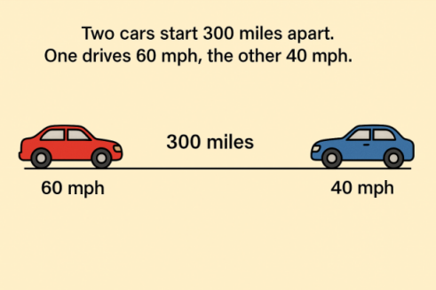

# **Linear Equations**

## Chapter 3: Solving Linear Equations in One Variable

### What is a Linear Equation in One Variable?

A **linear equation in one variable** is an equation that can be written in the form:

`ax + b = c`

Where:

-   `x` is the variable
-   `a`, `b`, and `c` are constants
-   `a ≠ 0`

---

### Solving Basic Linear Equations

#### Example 1: Normal

`2x + 3 = 11`

**Step 1:** Subtract 3 from both sides  
`2x = 8`

**Step 2:** Divide by 2  
`x = 4`

---

### Solving Equations with Fractions

#### Example 2: Fraction Involved

`x / 3 + 2 = 5`

**Step 1:** Subtract 2 from both sides  
`x/3 = 3`

**Step 2:** Multiply both sides by 3  
`x = 9`

> Tip: Eliminate all denominators first by multiplying with the **LCM** of all denominators.

---

### Solving Equations with Decimals

#### Example 3: Decimal Involved

`0.4x - 1.2 = 0.8`

**Step 1:** Add 1.2 to both sides  
`0.4x = 2.0`

**Step 2:** Divide by 0.4  
`x = 5`

---

## Chapter 4: Types of Solutions

Linear equations can have **one solution**, **no solution**, or **infinitely many solutions**.

---

### 1. Conditional Equation (One Solution)

An equation is **conditional** if it is true for **only one value** of the variable.

**Example:**  
`3x - 2 = 10` → `x = 4`

✅ Only one solution → Conditional

---

### 2. Contradiction (No Solution)

When solving leads to a **false statement** like `0 = 5`, the equation has **no solution**.

**Example:**

`2x + 3 = 2x - 4`

Subtract `2x` from both sides:  
`3 = -4` → ❌ False

❌ No value of `x` satisfies the equation  
❌ No solution → Contradiction

---

### 3. Identity (Infinitely Many Solutions)

When both sides of the equation are **exactly the same**, the equation is true for **all values** of `x`.

**Example:**

`4x + 2 = 4x + 2`

Subtract `4x` from both sides:  
`2 = 2` → ✅ Always true

♾️ All values of `x` are solutions → Identity

---

### Summary

| Type        | Description                      | Example           |
| ----------- | -------------------------------- | ----------------- |
| Conditional | One specific solution            | `x = 3`           |
| No Solution | False statement (contradiction)  | `2x + 1 = 2x - 3` |
| Identity    | Always true (infinite solutions) | `5x + 2 = 5x + 2` |

---

### Practice Problems

1. Solve: `5x - 7 = 18`
2. Solve: `(x/2) + 1 = 4`
3. Solve: `0.5x + 0.2 = 1.2`
4. Determine the type: `6x + 3 = 6x + 8`
5. Determine the type: `4x - 1 = 4x - 1`

---

**Tips:**

-   Always simplify both sides first.
-   Watch out for fractions and decimals—clear them early!
-   Check your answer by substituting back into the original equation.

## Chapter 5: Repeating Decimals to Fractions

### Key Concept

Every repeating decimal is a **rational number** (can be written as a fraction).  
**Example**:

-   \\(  0.\overline{3} = \frac{1}{3}  \\)
-   \\(  0.\overline{12} = \frac{4}{33}  \\)

---

### Conversion Steps (Pure Repeating Decimals)

**Rule**: For \\(  0.\overline{ab}  \\), fraction = \\(  \frac{ab}{99}  \\).

#### Example 1: Single-Digit Repeater

Convert \\(  0.\overline{7}  \\) to a fraction:

1. Let \\(  x = 0.\overline{7}  \\)
2. Multiply by 10: \\(  10x = 7.\overline{7}  \\)
3. Subtract original: \\(  10x - x = 7.\overline{7} - 0.\overline{7}  \\)
4. Solve: \\(  9x = 7  \\) → \\(  x = \frac{7}{9}  \\)

#### Example 2: Double-Digit Repeater

Convert \\(  0.\overline{45}  \\) to a fraction:

1. Let \\(  x = 0.\overline{45}  \\)
2. Multiply by 100: \\(  100x = 45.\overline{45}  \\)
3. Subtract: \\(  100x - x = 45.\overline{45} - 0.\overline{45}  \\)
4. Solve: \\(  99x = 45  \\) → \\(  x = \frac{45}{99} = \frac{5}{11}  \\)

---

### Mixed Repeating Decimals (Non-Repeating + Repeating Parts)

**Rule**: For \\(  0.a\overline{bc}  \\), fraction = \\(  \frac{abc - a}{990}  \\).

#### Example 3: Mixed Decimal

Convert \\(  0.2\overline{6}  \\) to a fraction:

1. Let \\(  x = 0.2\overline{6}  \\)
2. Multiply by 10: \\(  10x = 2.\overline{6}  \\)
3. Multiply by 100: \\(  100x = 26.\overline{6}  \\)
4. Subtract step 2 from step 3: \\(  90x = 24  \\)
5. Solve: \\(  x = \frac{24}{90} = \frac{4}{15}  \\)

---

### Summary Table

| Type                  | Example               | Fraction                         | Steps Involved                      |
| --------------------- | --------------------- | -------------------------------- | ----------------------------------- |
| Pure Repeating        | \\(  0.\overline{3}  \\)  | \\(  \frac{1}{3}  \\)                | Multiply by 10ⁿ, subtract, solve    |
| Multi-Digit Repeating | \\(  0.\overline{12}  \\) | \\(  \frac{4}{33}  \\)               | Multiply by 100, subtract, simplify |
| Mixed Repeating       | \\(  0.1\overline{6}  \\) | \\(  \frac{5}{30} = \frac{1}{6}  \\) | Multiply by 10 and 100, subtract    |

---

### Common Mistakes to Avoid

1. **Incorrect multiplier**:
    - For \\(  0.\overline{ab}  \\), multiply by 100 (not 10).
2. **Forgetting to simplify**:
    - Always reduce fractions (e.g., \\(  \frac{45}{99} = \frac{5}{11}  \\)).
3. **Miscounting digits**:
    - \\(  0.\overline{123}  \\) has 3 repeating digits → multiply by 1000.

---

### Practice Problems

1. Convert \\(  0.\overline{9}  \\) to a fraction. _(Hint: It equals 1!)_
2. Convert \\(  0.3\overline{18}  \\) to a fraction.  
   **Solution**:
    - Let \\(  x = 0.3\overline{18}  \\)
    - \\(  100x = 31.\overline{18}  \\)
    - \\(  10x = 3.\overline{18}  \\)
    - Subtract: \\(  90x = 28  \\) → \\(  x = \frac{28}{90} = \frac{14}{45}  \\)

## Chapter 6: Solving Linear Equations for a Specified Variable

### Key Concept

Rearranging formulas to **isolate a specific variable** (useful in science, finance, and engineering).

**General Steps**:

1. Identify the target variable.
2. Use inverse operations to isolate it.
3. Maintain equality by performing the same operation on both sides.

---

#### Example 1: Simple Linear Equation

**Solve for \\(  y  \\):**  
\[ 3x + 2y = 12 \]

**Steps**:

1. Subtract \\(  3x  \\):  
   \[ 2y = 12 - 3x \]
2. Divide by 2:  
   \[ y = \frac{12 - 3x}{2} \quad \text{or} \quad y = 6 - \frac{3}{2}x \]

---

#### Example 2: Formula from Geometry

**Solve for \\(  r  \\):**  
\[ C = 2\pi r \]

**Steps**:

1. Divide both sides by \\(  2\pi  \\):  
   \[ r = \frac{C}{2\pi} \]

**Application**: Finding radius given circumference.

---

#### Example 3: Equation with Fractions

**Solve for \\(  x  \\):**  
\[ \frac{2}{3}x + 4y = 10 \]

**Steps**:

1. Subtract \\(  4y  \\):  
   \[ \frac{2}{3}x = 10 - 4y \]
2. Multiply by \\(  \frac{3}{2}  \\):  
   \[ x = \frac{3}{2}(10 - 4y) = 15 - 6y \]

---

#### Example 4: Multi-Variable Equation

**Solve for \\(  m  \\):**  
\[ y = mx + b \]

**Steps**:

1. Subtract \\(  b  \\):  
   \[ y - b = mx \]
2. Divide by \\(  x  \\):  
   \[ m = \frac{y - b}{x} \]

**Note**: \\(  x \neq 0  \\).

---

#### Example 5: Real-World Application (Temperature Conversion)

**Solve for \\(  F  \\):**  
\[ C = \frac{5}{9}(F - 32) \]

**Steps**:

1. Multiply by \\(  \frac{9}{5}  \\):  
   \[ \frac{9}{5}C = F - 32 \]
2. Add 32:  
   \[ F = \frac{9}{5}C + 32 \]

---

#### Example 6: Complex Formula (Kinematics)

**Solve for \\(  t  \\):**  
\[ s = ut + \frac{1}{2}at^2 \]

**Steps**:

1. Rewrite as quadratic equation:  
   \[ \frac{1}{2}at^2 + ut - s = 0 \]
2. Apply quadratic formula:  
   \[ t = \frac{-u \pm \sqrt{u^2 + 2as}}{a} \]

**Note**: Discard negative time solutions.

---

### Common Mistakes

1. **Incorrect distribution**:
    - Wrong: \\(  \frac{a + b}{c} \neq \frac{a}{c} + b  \\).
2. **Dividing variables**:
    - Ensure the divisor is not zero (e.g., \\(  x  \\) in Example 4).
3. **Sign errors**:
    - When moving terms, change signs (e.g., \\(  +b  \\) becomes \\(  -b  \\)).

---

### Practice Problems

1. Solve for \\(  h  \\): \\(  A = \frac{1}{2}bh  \\).  
   **Solution**: \\(  h = \frac{2A}{b}  \\).
2. Solve for \\(  r  \\): \\(  V = \pi r^2 h  \\).  
   **Solution**: \\(  r = \sqrt{\frac{V}{\pi h}}  \\).
3. Solve for \\(  y  \\): \\(  5x - 3y = 15  \\).  
   **Solution**: \\(  y = \frac{5x - 15}{3}  \\).

## Chapter 7: Applications of Linear Equations

### Basic Applications

#### Example 1: Number Problem

**Problem**: One number is 3 less than 4 times another. Their sum is 42. Find the numbers.  
**Solution**:

1. Let \\(  x  \\) = smaller number → larger = \\(  4x - 3  \\)
2. Equation: \\(  x + (4x - 3) = 42  \\)
3. Solve: \\(  5x = 45  \\) → \\(  x = 9  \\)
4. **Answer**: Numbers are 9 and 33

#### Example 2: Age Problem

**Problem**: Maria is 10 years older than Luis. In 5 years, she’ll be twice as old. Find current ages.  
**Solution**:

1. Now: Luis = \\(  x  \\), Maria = \\(  x + 10  \\)
2. Future: \\(  x + 10 + 5 = 2(x + 5)  \\)
3. Solve: \\(  x + 15 = 2x + 10  \\) → \\(  x = 5  \\)
4. **Answer**: Luis = 5, Maria = 15

#### Example 3: Distance Problem

**Problem**: Two cars start 300 miles apart. One drives 60 mph, the other 40 mph. When will they meet?  
**Solution**:

1. Combined speed = 100 mph
2. Time = Distance/Speed = \\(  300/100 = 3  \\) hours

#### Example 4: Perimeter Problem

**Problem**: A rectangle’s width is 5 cm less than its length. Perimeter is 50 cm. Find dimensions.  
**Solution**:

1. Let length = \\(  x  \\) → width = \\(  x - 5  \\)
2. Equation: \\(  2(x + x - 5) = 50  \\)
3. Solve: \\(  4x = 60  \\) → \\(  x = 15  \\)
4. **Answer**: 15 cm × 10 cm

#### Example 5: Cost Problem

**Problem**: 3 notebooks and 2 pens cost \$18. A notebook costs \$1 more than a pen. Find individual prices.  
**Solution**:

1. Let pen = \\(  x  \\) → notebook = \\(  x + 1  \\)
2. Equation: \\(  3(x + 1) + 2x = 18  \\)
3. Solve: \\(  5x = 15  \\) → \\(  x = 3  \\)
4. **Answer**: Pen = \$3, Notebook = \$4

---

### Mixture & Work Problems

#### Example 6: Mixture Problem

**Problem**: How many liters of 30% acid solution should be added to 10L of 60% solution to get 40% acid?  
**Solution**:

1. Let \\(  x  \\) = liters of 30% solution
2. Equation: \\(  0.3x + 0.6(10) = 0.4(x + 10)  \\)
3. Solve: \\(  x = 20  \\) L

#### Example 7: Work Rate Problem

**Problem**: Printer A completes a job in 6 hours, Printer B in 4 hours. How long working together?  
**Solution**:

1. Combined rate: \\(  \frac{1}{6} + \frac{1}{4} = \frac{5}{12}  \\) jobs/hour
2. Time: \\(  \frac{12}{5} = 2.4  \\) hours (2h 24m)

#### Example 8: Investment Problem

**Problem**: \$8000 is invested at 5% and 7% interest. Total annual interest is \$500. Find amounts at each rate.  
**Solution**:

1. Let \\(  x  \\) = amount at 5% → \\(  8000 - x  \\) at 7%
2. Equation: \\(  0.05x + 0.07(8000 - x) = 500  \\)
3. Solve: \\(  x = 3000  \\)
4. **Answer**: \$3000 at 5%, \$5000 at 7%

#### Example 9: Chemical Mixture

**Problem**: A 25% alcohol solution is mixed with a 50% solution to make 10L of 40% solution. How much of each?  
**Solution**:

1. Let \\(  x  \\) = liters of 25% → \\(  10 - x  \\) = liters of 50%
2. Equation: \\(  0.25x + 0.5(10 - x) = 4  \\)
3. Solve: \\(  x = 4  \\) L
4. **Answer**: 4L of 25%, 6L of 50%

#### Example 10: Pool Draining

**Problem**: Pipe A fills a pool in 8 hours. Pipe B drains it in 12 hours. How long to fill if both are open?  
**Solution**:

1. Net rate: \\(  \frac{1}{8} - \frac{1}{12} = \frac{1}{24}  \\) pool/hour
2. Time: 24 hours

---

### Advanced Applications

#### Example 11: Break-Even Analysis

**Problem**: A product costs \$7 to make and sells for \$15. Fixed costs are \$4000. Find break-even quantity.  
**Solution**:

##### **Step-by-Step Understanding**:

1. **What is Break-Even?**

    - The point where **total revenue = total costs** (no profit, no loss).
    - _Analogy_: Imagine selling lemonade. You need to sell enough cups to pay for lemons, sugar, and your stand rental.

2. **Define Variables**:

    - Let \\(  x  \\) = number of items sold.

3. **Cost Components**:

    - **Variable Cost**: \$7 per item → Total variable cost = \\(  7x  \\).
    - **Fixed Cost**: \$4000 (doesn’t change with number of items).
    - **Total Cost**: \\(  7x + 4000  \\).

4. **Revenue**:

    - Selling price = \$15/item → Total revenue = \\(  15x  \\).

5. **Set Up Equation**:  
   \[
   \text{Revenue} = \text{Total Cost} \\
   15x = 7x + 4000
   \]

6. **Solve**:  
   \[
   15x - 7x = 4000 \newline
   8x = 4000 \newline
   x = 500
   \]

✅ **Conclusion**: Sell **500 items** to break even.

#### Example 12: Distance Between Trains

**Problem**: Train A leaves at 60 mph. Train B leaves 2 hours later at 80 mph. When will B catch A?  
**Solution**:

1. Let \\(  t  \\) = time after B departs
2. Distance A: \\(  60(t + 2)  \\)
3. Distance B: \\(  80t  \\)
4. Set equal: \\(  80t = 60t + 120  \\) → \\(  t = 6  \\) hours

#### Example 13: Percentage Change

**Problem**: A price increased by 25% then decreased by 20%. Final price is \$120. Find original price.  
**Solution**:

##### **Step-by-Step Understanding**:

1. **Understand the Changes**:

    - **First**: Price goes up by 25% (×1.25).
    - **Second**: New price is reduced by 20% (×0.80).

2. **Define Variable**:

    - Let \\(  x  \\) = original price.

3. **Set Up Equation**:  
   \[
   \text{Final Price} = x \times 1.25 \times 0.80 \newline
   120 = x \times 1.00 \newline
   x = 120
   \]

🤔 **Why 1.00?**

-   \\(  1.25 \times 0.80 = 1.00  \\) → The changes cancel out!
-   _Analogy_: If you increase a number by 25% then decrease it by 20%, you return to the original value.

✅ **Original Price**: \$120.

#### Example 14: Consecutive Integers

**Problem**: Sum of three consecutive odd integers is 75. Find them.  
**Solution**:

1. Let \\(  x  \\) = first integer → \\(  x + 2  \\), \\(  x + 4  \\)
2. Equation: \\(  x + (x + 2) + (x + 4) = 75  \\)
3. Solve: \\(  x = 23  \\)
4. **Answer**: 23, 25, 27

---

#### Key Problem-Solving Steps:

1. **Define variables** clearly
2. **Translate words** to equations
3. **Solve systematically**
4. **Check solutions** in original context
