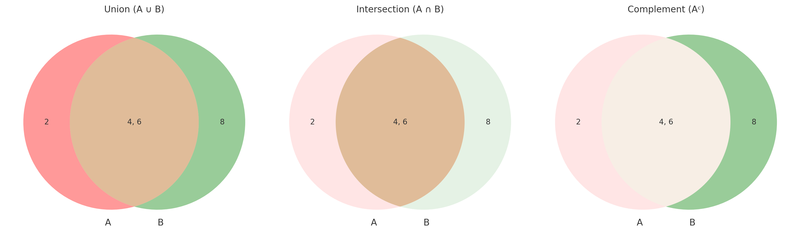

# **Sets**

## Chapter 1: What is a Set?

A **set** is a collection of distinct objects or elements. These elements can be numbers, letters, or anything else.

Example:

-   Set of vowels = `{a, e, i, o, u}`
-   Set of even numbers less than 10 = `{2, 4, 6, 8}`

---

### 1. Roster Method (or Tabular Form)

List all the elements of a set, separated by commas, and enclosed in curly brackets `{}`.

Example:  
Set of first five natural numbers = `{1, 2, 3, 4, 5}`

---

### 2. Order of Elements Doesn't Matter

In a set, the **order** of elements does not matter.

Example:  
`{a, b, c}` is the same as `{c, b, a}`

Also, **no repetition**:  
`{1, 2, 2, 3}` is same as `{1, 2, 3}`

---

### 3. Empty Set (or Null Set)

A set with **no elements** is called the **empty set**. It is represented as:

-   `{ }` or `∅`

Example:  
Set of prime numbers between 0 and 1 = `∅`

---

### 4. Types of Sets

-   **Finite Set**: Countable number of elements  
    Example: `{1, 3, 5, 7}`
-   **Infinite Set**: Uncountable elements  
    Example: `{1, 2, 3, 4, 5, ...}`

-   **Equal Sets**: Two sets with exactly the same elements  
    Example: `{a, b, c}` and `{c, a, b}`

-   **Equivalent Sets**: Same number of elements, not necessarily the same elements  
    Example: `{1, 2, 3}` and `{a, b, c}`

-   **Singleton Set**: A set with only one element  
    Example: `{0}`

---

### 5. Subsets and Types of Subsets

A **subset** is a set in which every element is also in another set.

If `A = {1, 2}`, then possible subsets of A are:

-   `{}`, `{1}`, `{2}`, `{1, 2}`

#### Types of Subsets:

-   **Proper Subset**: Does **not** contain all elements  
    Example: `{1}` is a proper subset of `{1, 2}`
-   **Improper Subset**: The **whole** set itself  
    Example: `{1, 2}` is an improper subset of `{1, 2}`

---

### 6. How Many Subsets Can Be Made from a Set?

If a set has `n` elements, then number of subsets = `2ⁿ`

Example:  
Set `A = {a, b, c}` → 3 elements  
Subsets = `2³ = 8` subsets  
Subsets: `{}`, `{a}`, `{b}`, `{c}`, `{a,b}`, `{a,c}`, `{b,c}`, `{a,b,c}`

---

## Chapter 2: Venn Diagrams

Used to **visually represent** sets and their relationships.

### Basic Operations:

#### Union ( ∪ )

All elements from both sets  
`A ∪ B = {x | x ∈ A or x ∈ B}`

**Example:**
A = `{2, 4, 6}`, B = `{4, 6, 8}` → `A ∪ B = {2, 4, 6, 8}`

#### Intersection ( ∩ )

Common elements in both sets  
`A ∩ B = {x | x ∈ A and x ∈ B}`

**Example:**
A = `{2, 4, 6}`, B = `{4, 6, 8}` → `A ∩ B = {4, 6}`

#### Complement ( A' or Aᶜ )

Elements **not** in the set (relative to universal set)

**Example:**
A = `{2, 4, 6}`, B = `{4, 6, 8}` → `Aᶜ = {8}`

---

## Summary

-   A set is an unordered collection of unique elements.
-   Use roster method to list set elements.
-   Understand types of sets, subsets, and how to calculate them.
-   Use Venn diagrams to visualize union, intersection, and complement.
